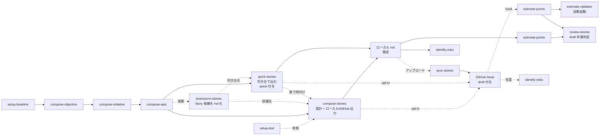

# leadcraft

[English](README.md) | 日本語

テックリードが書く・整える構造化された成果物（計画 / 見積もり / アーキテクチャ判断 / 設計ドキュメント）を支援する Claude Code プラグイン。

生成物は **[OKF（Open Knowledge Format）](https://github.com/GoogleCloudPlatform/knowledge-catalog/blob/main/okf/SPEC.md) v0.1 準拠の Knowledge Bundle**（YAML frontmatter + markdown のディレクトリツリー）として出力され、人間にも AI エージェントにも読め、git で版管理できる。

Story 層のトラッカー（保存先）は**抽象化**されており、**既定では外部依存ゼロのローカル markdown**（OKF concept）として動く。GitHub Issue + Projects 連携は opt-in のアダプタとして利用できる。

## 特徴

- **5 階層計画モデル**: Objective / Initiative / Epic / Story / Task
- **OKF 準拠の知識バンドル**: `type` / `title` / `description` / `tags` / `timestamp` / `resource` を備えた frontmatter、`index.md`（目次）/ `log.md`（履歴）、バンドル絶対リンク
- **トラッカー非依存**: Story 操作を抽象契約（`references/tracker-contract.md`）経由で呼び、アダプタ（`references/backends/<provider>.md`）が具体実装を提供。新トラッカー対応はアダプタ 1 ファイルの追加で完結
- **ゼロ設定で起動**: 既定の `local` プロバイダなら `gh` CLI も外部サービスも不要

## 階層モデル

| 階層 | 概要 | 管理場所 |
|------|------|----------|
| Objective | 経営・事業・プロダクト上の大きな目標（What / Why） | `<root>/<objective>/README.md` |
| Initiative | Objective を実現する大きな取り組み（How）。インセプションデッキ 10 の問いを集約 | `<root>/<objective>/<initiative>/README.md` |
| Epic | 複数の Story を束ねるプロダクトバックログアイテム | `<root>/<objective>/<initiative>/<epic>/README.md` |
| Story | ユーザー価値を届ける最小単位 | トラッカー（既定 local: `<epic-dir>/<slug>.md`） |
| Task | Story の作業項目 | Story 本文のチェックリスト |

`<root>` は `.claude/leadcraft.md` の `output.root_dir`（`compose-objective` 初回実行時に対話で確定）。この配下のツリー全体が OKF Knowledge Bundle になる。

## アーキテクチャ

```
┌─────────────────────────────────────────────┐
│  スキル（compose-* / quick-stories / …）       │
│  トラッカー操作を「抽象操作」で呼ぶ            │
│  （create_item / set_field / add_comment …）  │
└───────────────┬─────────────────────────────┘
                │ references/tracker-contract.md（抽象契約）
        ┌───────┴────────┐
        ▼                ▼
  backends/local.md   backends/github.md
  （既定・依存ゼロ）    （opt-in）
   Story = md          Story = Issue+Projects
        │
        ▼
  <root_dir>/ ツリー = OKF Knowledge Bundle
  （build-bundle が index.md / log.md / okf_version を整備・検証）
```

## 収録スキル

| スキル | 役割 |
|--------|------|
| [setup-baseline](skills/setup-baseline/SKILL.md) | フィボナッチ基準点（2pt / 8pt）の登録 |
| [setup-dod](skills/setup-dod/SKILL.md) | Story 共通の Definition of Done を登録・編集 |
| [compose-objective](skills/compose-objective/SKILL.md) | Objective を 1 件対話で整える（KPI / マイルストーン） |
| [compose-initiative](skills/compose-initiative/SKILL.md) | Initiative を 1 件整える（インセプションデッキ 10 の問い） |
| [compose-epic](skills/compose-epic/SKILL.md) | Epic を 1 件整える（DoD / 価値仮説 / ユーザーフロー） |
| [brainstorm-stories](skills/brainstorm-stories/SKILL.md) | Story 候補をざっくり一覧化（`stories-draft.md`） |
| [compose-stories](skills/compose-stories/SKILL.md) | Story を詳細設計してトラッカーへ登録（既定 local） |
| [quick-stories](skills/quick-stories/SKILL.md) | Story を最短手数で登録（叩き台用途） |
| [compose-hotfix](skills/compose-hotfix/SKILL.md) | 緊急対応 Story を起票（`hotfix` ラベル） |
| [estimate-points](skills/estimate-points/SKILL.md) | PERT / 単純見積もり（フィボナッチ） |
| [identify-risks](skills/identify-risks/SKILL.md) | リスク識別と PERT 悲観値への反映 |
| [convert-points-to-time](skills/convert-points-to-time/SKILL.md) | ポイント → 時間換算・工期算出（JUAS 式） |
| [review-stories](skills/review-stories/SKILL.md) | draft 品質ゲート（6 観点）と卒業判定 |
| [sync-stories](skills/sync-stories/SKILL.md) | ローカル Story → GitHub Issue アップロード（github アダプタ。opt-in） |
| [write-adr](skills/write-adr/SKILL.md) | Architecture Decision Record の作成 |
| [write-dd](skills/write-dd/SKILL.md) | Design Doc の作成（生きたドキュメント） |
| [build-bundle](skills/build-bundle/SKILL.md) | OKF バンドルの `index.md` / `log.md` 生成・適合検証 |

このほか、`estimate-validator` エージェント（`estimate-points` 完了後に自動起動）と 2 つの hook を同梱する: `notify-draft-added.sh`（`draft` 付与時に見積もり / レビューへの遷移を促す）と `guard-project-field-mutation.sh`（Projects フィールド option の破壊的変更をハードブロック。`github` プロバイダ時のみ作動）。

## インストール

```bash
# マーケットプレイス経由（公開後）
/plugin marketplace add dskst/leadcraft
/plugin install leadcraft

# またはローカルディレクトリを指定して開発利用
```

## セットアップ

```
/setup-baseline   # フィボナッチ見積もりの基準点（2pt / 8pt）を登録
/setup-dod        # Story 共通の Definition of Done を登録
```

設定は `.claude/leadcraft.md` に保存される（**チーム共有設定としてコミット推奨**）。雛形は `skills/setup-baseline/templates/leadcraft.md`。

既定の `tracker.provider: local` では追加依存は不要。GitHub 連携（opt-in）を使う場合のみ `gh` CLI を `project` スコープ付きで認証する。

## ワークフロー（local 既定）



実線が標準ルート、点線は条件分岐・opt-in。**local が既定ルート**で、GitHub 連携は opt-in（実装済みアダプタ）。ローカルルートは md 書き出し → ローカル md で見積もり / リスク評価 → `sync-stories` で Issue 化 → 以降は GitHub ルートに合流する。

以下は全スキルを通した直線パイプライン:

```
setup-baseline / setup-dod
   → compose-objective → compose-initiative → compose-epic
   → (brainstorm-stories) → compose-stories / quick-stories / compose-hotfix（local md 生成）
   → estimate-points（→ estimate-validator）→ identify-risks → review-stories
   → (convert-points-to-time / write-adr / write-dd は必要に応じて)
   → build-bundle（index.md / log.md / OKF 適合検証）
   → sync-stories（GitHub Issue へアップロード。opt-in）
```

生成されたツリーはそのまま OKF Knowledge Bundle であり、git でコミットして共有・配布できる。

## OKF 準拠について

`<root_dir>/` 配下の成果物は OKF v0.1 の Knowledge Bundle として扱う。準拠規約の詳細は [`references/okf-conformance.md`](references/okf-conformance.md) を参照。`build-bundle` スキルが適合条件（全非予約 `.md` がパース可能な frontmatter + 非空 `type` を持つ等）を検証する。

## ライセンス

MIT。詳細は [LICENSE](LICENSE)。

## コントリビューション

[CONTRIBUTING.md](CONTRIBUTING.md) を参照。新しいトラッカーアダプタの追加（GitLab / Jira / Backlog 等）を歓迎する。
