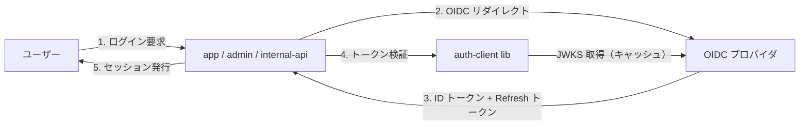

# 認証基盤の OIDC 移行設計

## 背景とスコープ

本 Epic（`oidc-migration`）は、親 Initiative（`auth-overhaul`）の KPI「不正アクセス検知から対応開始までの平均時間（MTTR）を 50% 短縮」と、Objective（`platform-modernization`）の「2026 上期に主要システムを標準スタックに揃える」に直接寄与する。

現在の認証基盤は独自実装のセッション Cookie + DB ステート方式である。`Grep` 調査では認証ロジックが 12 ファイル / 47 箇所に分散しており、3 つのサービス（`app`, `admin`, `internal-api`）でそれぞれ微妙に異なる実装を保持している。これにより:

- セッションリフレッシュロジックの不整合が散発的に発生（過去半年で 4 件の障害起票）
- 監査ログのフォーマットがサービス間で揃わず、不正アクセス検知が遅れる
- 新規サービスを追加するたびに認証ロジックを再実装する必要があり、Epic 1 件あたり 5〜8pt の見積もりオーバーヘッド

**スコープ**: `app`, `admin`, `internal-api` 3 サービスの認証層の OIDC（OpenID Connect）への移行。
**スコープ外**: 認可（Authorization）ロジックの変更、ユーザー属性の移行、SSO IdP 自体の選定（ADR `20251020-select-idp` で別途決定済み）。

## ゴールと非ゴール

### ゴール

- 3 サービスの認証ロジックを単一の OIDC クライアントライブラリに統合し、独自実装を撤廃する
- ID トークンの検証・更新・失効を OIDC 標準フローで一元化する
- 監査ログを共通フォーマット（W3C Trace Context 互換）で出力する
- 既存ユーザーの再ログインを強制せず、段階的にセッションを移行する

### 非ゴール

- 認可ロジック（RBAC / ABAC 判定）の刷新は本設計では扱わない（別 Epic で対応）
- 多要素認証（MFA）の導入は本設計の射程外（IdP 側で実現するため、本設計は IdP の MFA 設定に依存する）
- 旧セッション Cookie 形式の 100% 即時廃止は行わない（移行期間 3 ヶ月で段階廃止）

## 設計

### 概要

3 サービス共通の `auth-client` ライブラリを新規作成し、各サービスはそれを薄くラップする形で利用する。IdP は ADR `20251020-select-idp` で選定済みの標準 OIDC プロバイダ。トークン検証は JWKS をキャッシュして高速化する。

### 詳細

**`auth-client` ライブラリ**:
- 各サービスは `AuthClient.verify(token)` / `AuthClient.refresh()` の 2 関数だけを使う
- JWKS は 1 時間 TTL でメモリキャッシュ。失効時は IdP の `/.well-known/openid-configuration` から再取得
- セッション情報は ID トークンの `sub` / `email` / `roles` クレームから抽出し、サービス固有のセッションストアに保存

**段階的移行**:
1. `auth-client` ライブラリの公開（Story `publish-auth-client`）
2. 新規セッション発行を OIDC フローに切り替え（Story `switch-session-issuance`、旧 Cookie と並行運用）
3. 旧 Cookie の段階廃止（Story `retire-legacy-cookie`、3 ヶ月の移行期間後）

**監査ログ**:
- 共通スキーマ（`trace_id`, `user_id`, `action`, `result`, `timestamp`）で出力
- 既存のログ集約基盤に統合

## 検討した代替案

### 案 A: SAML 2.0 ベースの統合

- **概要**: 既存の社内システムで採用実績がある SAML を使い、各サービスに SP（Service Provider）モジュールを組み込む
- **採用しなかった理由**: モバイル / SPA との相性が悪く、本 Epic で対象となる `app` のクライアントサイド統合に追加実装が必要。OIDC は JSON ベースで現代的なクライアントとの親和性が高い

### 案 B: 独自実装の改修（OAuth 2.0 のみ）

- **概要**: 既存の独自認証を OAuth 2.0 風に整理し、3 サービスで共有ライブラリ化する
- **採用しなかった理由**: 標準仕様（OIDC）から外れるため、SaaS 連携・将来の SSO 拡張で再度独自対応が必要になる。Initiative のゴール「標準スタックに揃える」と矛盾

### 現状維持

- **概要**: 独自実装をサービスごとに維持する
- **採用しなかった理由**: Initiative の MTTR 50% 短縮 KPI が達成不能。新規サービス追加の認証実装オーバーヘッドが継続

## 横断的な関心事

- **セキュリティ**: ID トークン検証は標準ライブラリ（`jose`）で実装。JWKS キャッシュの失効をテストで担保。Refresh トークンは HttpOnly Cookie に格納
- **プライバシー**: IdP から取得する属性は `sub` / `email` / `roles` に限定。`name` や生年月日等の追加属性は本設計の射程外
- **可観測性**: 認証フロー各段階で `trace_id` を伝搬。失敗時のメトリクスを `auth.failure.*` ダッシュボードで集計
- **パフォーマンス**: トークン検証は JWKS キャッシュ前提で p99 < 5ms を SLO に設定。IdP 障害時は短期のキャッシュ延命でフェイルセーフ
- **運用**: 旧 Cookie と新 OIDC セッションの並行運用期間中は両方の発行・破棄ロジックを保守する必要あり。デプロイは Feature Flag で段階制御
- **コスト**: IdP は既存の標準 OIDC プロバイダを流用するため追加ライセンス費用なし。インフラコストの増分は JWKS キャッシュ用の Redis 1 ノード（月額 ~$30）のみ

# Citations

- `src/auth/session.ts:21` — 独自セッション発行ロジック（`app`）
- `services/admin/auth/middleware.ts:54` — `admin` 側の別実装（統合対象）
- `services/internal-api/auth.go:88` — `internal-api` 側の別実装（統合対象）
