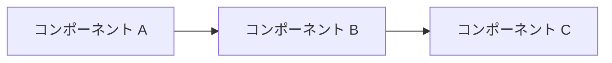

# {{TITLE}}

<!-- ファイル名規則: design-docs/{id}.md（{id} = <kebab-case-title>。例: design-docs/unified-auth-platform.md）。Design Doc は生きたドキュメントなので、改訂時もファイル名は変えず同ファイルを上書き更新する -->
<!-- 配置先（level に応じる）:
       cross-objective → <root>/design-docs/...
       objective       → <root>/<objective>/design-docs/...
       initiative      → <root>/<objective>/<initiative>/design-docs/...
       epic            → <root>/<objective>/<initiative>/<epic>/design-docs/... -->
<!-- タイトルに DD-XXXX のような ID プレフィックスを付けない。ID は frontmatter の `id` とファイル名で管理する -->
<!-- 内部リンク（親 README・関連 Story・関連 ADR）はバンドル絶対パス（`/` 始まり）で書く -->

## 背景とスコープ

<!-- Context and Scope -->
<!-- 読み手が前提知識なしで「なぜこの設計が必要か」を理解できるように、客観的な事実と現状を 1〜3 段落で記述する -->
<!-- 親階層（Objective / Initiative / Epic）の文脈と接続する -->
<!-- Grep / Glob で取得した実データ（ファイル数・参照箇所数・依存関係）を含める -->
<!-- level=cross-objective の場合は、影響を受ける Objective を 2 件以上明示し、それぞれの KPI / スコープへの関連を記述する -->
<!-- スコープ外（このドキュメントが扱わない領域）を明示する -->

## ゴールと非ゴール

<!-- Goals and Non-Goals -->
<!-- 達成すべきこと（Goals）を箇条書きで -->
<!-- 「これも実現できそうだが、本設計では意図的にやらない」ことを非ゴール（Non-Goals）として明示する -->
<!-- 非ゴールは後からスコープクリープを防ぐ重要な装置である -->

### ゴール

- （達成すべきこと 1）
- （達成すべきこと 2）

### 非ゴール

- （意図的にやらないこと 1。なぜやらないかの一言も書くと親切）
- （意図的にやらないこと 2）

## 設計

<!-- The Actual Design -->
<!-- 概要 → 詳細の順で書く -->
<!-- アーキテクチャ図（mermaid 推奨）、データフロー、API、データモデル、状態遷移などを必要に応じて -->
<!-- トレードオフと、なぜこの設計がゴールを最もよく満たすかを明示する -->
<!-- 詳細な実装フェーズ・工数・担当は Story に分離する（本ドキュメントでは触れない） -->

### 概要

（高レベルでの設計を 3〜5 行）

### 詳細

（必要に応じてサブセクションに分けて記述）

## 検討した代替案

<!-- Alternatives Considered -->
<!-- 他に考えられた選択肢を 2〜3 件、それぞれについて「採用しなかった理由」を明示する -->
<!-- 「現状維持」も選択肢に含めると、変更の必要性が伝わる -->

### 案 A: （案名）

- **概要**: （何を提案するか）
- **採用しなかった理由**: （ゴールに対して不足する点 / リスク）

### 案 B: （案名）

- **概要**: （何を提案するか）
- **採用しなかった理由**: （ゴールに対して不足する点 / リスク）

### 現状維持

- **概要**: （何もしない場合の状況）
- **採用しなかった理由**: （Goals が達成されないままになる / 既存問題が継続する）

## 横断的な関心事

<!-- Cross-Cutting Concerns -->
<!-- 設計が組織の標準・横断要件にどう影響するかを明示する -->
<!-- 該当しない項目は「該当なし（理由）」で残し、空欄にしない -->

- **セキュリティ**: （認証・認可・データ暗号化への影響）
- **プライバシー**: （個人情報の扱い・収集・保持期間）
- **可観測性**: （ログ・メトリクス・トレーシング・アラート）
- **パフォーマンス**: （SLO / レイテンシ / スループットへの影響）
- **運用**: （デプロイ・ロールバック・モニタリング・障害対応）
- **コスト**: （インフラ / 運用 / ライセンス費用への影響。概算で可）

<!-- # Citations（任意）
       コードベース調査で得た file:line 根拠をこの慣用見出し下にまとめる（okf-conformance.md § 5）。 -->
